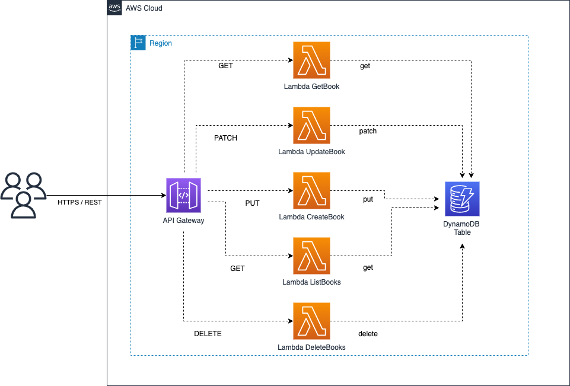

# Simple CRUD application to manage books

This projects uses an APIGateway with CORS enabled, pointing to five Lambdas executing CRUD operations on a single DynamoDB table.

## Build

To build this app, you need to be in this example's root folder. Then run the following:

```bash
npm install -g aws-cdk
npm install
npm run build
```

This will install the necessary CDK, then this example's dependencies, then the lambda functions' dependencies, and then build your TypeScript files and your CloudFormation template.

## Solution


## Deploy

Run `cdk deploy`. This will deploy / redeploy your Stack to your AWS Account.

After the deployment you will see the API's URL, which represents the url you can then use.

## The Component Structure

The whole component contains:

- An API, with CORS enabled on all HTTTP Methods. (Use with caution, for production apps you will want to enable only a certain domain origin to be able to query your API.)
- Lambda pointing to `src/create_book.py`, containing code for __storing__ a book  into the DynamoDB table.
- Lambda pointing to `src/delete_book.py`, containing code for __deleting__ books from the DynamoDB table.
- Lambda pointing to `src/get_books.py`, containing code for __getting all books__ from the DynamoDB table.
- Lambda pointing to `src/get_book.py`, containing code for __getting a book__ from the DynamoDB table.
- Lambda pointing to `src/update_book.py`, containing code for __updating a book__ in the DynamoDB table.
- A DynamoDB table `books` that stores the data.
- Five `LambdaIntegrations` that connect these Lambdas to the API.


## Useful commands

 * `npm run build`   compile typescript to js
 * `npm run watch`   watch for changes and compile
 * `npm run test`    perform the jest unit tests
 * `cdk deploy`      deploy this stack to your default AWS account/region
 * `cdk diff`        compare deployed stack with current state
 * `cdk synth`       emits the synthesized CloudFormation template
